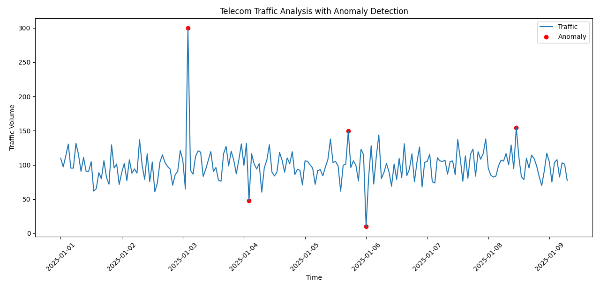

# TELECOM-TRAFFIC-ANALYSIS

## Data Generation

- Synthetic telecom traffic data is generated using a normal distribution
- Baseline traffic represents typical network behavior
- Artificial anomalies (spikes and drops) are injected manually

## Method

- Traffic data is analyzed using statistical techniques
- Anomaly detection is performed using thresholding:
  - Data points outside mean ± k·std are flagged as anomalies

## Example Output

The figure below shows telecom traffic patterns with detected anomalies (spikes and drops), which may indicate potential network congestion, faults, or abnormal system behavior in telecom infrastructure.

## Insights

- Sudden spikes may indicate traffic surges or network congestion
- Sudden drops may indicate failures or disruptions
- Statistical thresholding provides a simple baseline for anomaly detection

## Applications

- Network traffic monitoring
- Fault detection in telecom systems
- Early warning for congestion

## Limitations

- Uses simple statistical thresholding
- Does not capture temporal dependencies
- Can be improved using machine learning approaches (e.g., LSTM, Isolation Forest)
